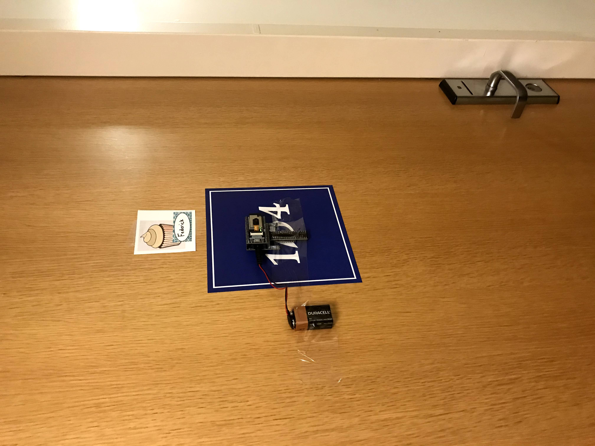
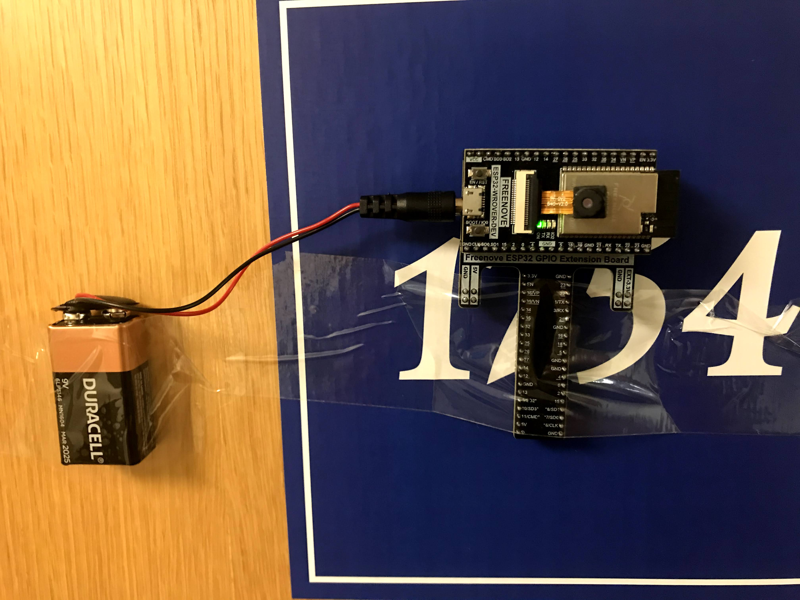

# E.D.S
## External Detection System

This repository contains arduno and python code that, together, can be used to create a door mounted system to detect if there is anyone outisde before you open your door, just as an extra precautionary covid measure. To make this code work, you need an ESP32 wrover module with its included camera (though you can use a different camera than the ESP32 comes with).  

[Video Demo](https://youtu.be/zhtUE-D50o8)
[Video demo but another one](https://youtu.be/RZlgFgfNq5Q)

# Table of Contents <!-- omit in toc -->
- [Setup](#setup)
  - [Hardware](#hardware)
  - [Software](#software)
  - [Location](#enclosure)
  - [Getting Started](#running)  

# Setup

## Hardware

This program is rather simple. It requires an esp32 wrover module with an attached camera, a 9v battery or other external power supply, access to wifi, and a second device which can run a python script. Simply plug in the power supply, attach the esp32 wrover module to the door which you wish to monitor, click the RST button and start the python script. 

## Software 

The Arduino code, which is to be run on the esp32. It is contained within the motionSensor folder. This activates the camera on the ESP32 and it downsamples the image, turning it from a bunch of pixels to larger blocks that are easier to work with, while also limiting sensitivity to noise in the environment which would make it seem like there is always motion. These blocks are then checked frame by frame to see if there are any changes, and based on how much a block has changed and how many blocks has changed, it is possible to determine whether or not something moved in the visible area of the camera. At the moment, if the blocks are different by a factor of 20% based on pixel values, then a block is marked as being changed, and if 10% of the blocks have been changed, then movement has been detected. 

Using the Tkinter library, a tiny window will appear with the text "Safe" visible. This window is resizeable and movable, so it can fit anywhere on the user's laptop screen, since during covid times the user will likely be on their laptop constantly. When motion is detected, the text will change to "There's someone outside", and it will be visible from when the motion starts until a few moments after the motion stops, allowing time for someone to walk past, and to make sure the user has time to view the text change before it reads "Safe" once again. 

## Location 

Since this is an external detection system, it was simply placed on the outside of my door. In Broadway hall, dorm rooms don't have peep holes which allow you to look outside and see who's in the hallway, a feature I remember having as a freshman in John Jay, and one that might be considered useful in today's climate. Because of this, The E.D.S. is situated in an area where it can resemble a peephole. Additionally, it's meant to be visible to passerby, as hopefully the presence of a camera makes people slightly less willing to walk near a particular doorway, giving you freedom to leave your room whenever you wish. 

## Getting Started

First, you must load the motionSensor script onto the esp32 module. This can be done by opening the Arduino program, compiling and uploading the code to the arduino, and being sure to hold down the boot button while this is occuring. Before anything else happens, you must change `const char* sid ` and `const char* password` in motionSensor.ino to match whatever WiFi network your esp32 will be connected to. While uploading the code from the ardunio, make sure to quickly open the serial monitor and take note of the listed IP address that the esp32 will be listening to, and replace UDP_IP in packetListener.py with that listed IP address. After that, plug in and mount the esp32 wherever you want to detect motion, and then run the python script after the esp32 has been turned on.  